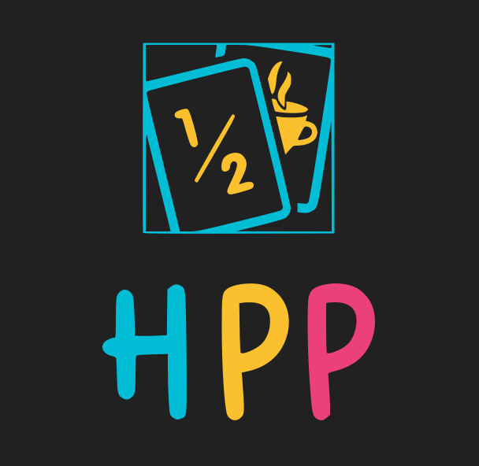

# Home Planning Poker


Home Planning Poker es una plataforma en la que podremos simular virtualmente la conocida practica llamada de manera similar: [Planning Poker](https://es.wikipedia.org/wiki/Planning_poker).
Aquí seremos capaces de crear una sala en línea, asignarle las tareas que queremos estimar en la sesión, elegir nuestro mazo favorito y finalmente invitar a nuestro equipo para estimar en conjunto.

## [Repositorio frontend](https://github.com/FrutosGaston/home-poker-planning-ui)

## Miembros
* [Frutos Gaston](https://www.linkedin.com/in/gaston-frutos/)

## Java Version
La version que java que se va a utilizar es la 11.0.10 basada en el OpenJDK.

## Swagger
### Swagger json
http://localhost:8080/api/v2/api-docs

### Swagger UI
http://localhost:8080/swagger-ui.html

## Tasks
### Build docker y push al registry

Ejecutar el siguiente task haciendo uso del gradle wrapper.

```

```

### Jacoco
```
./gradlew jacocoTestReport
```